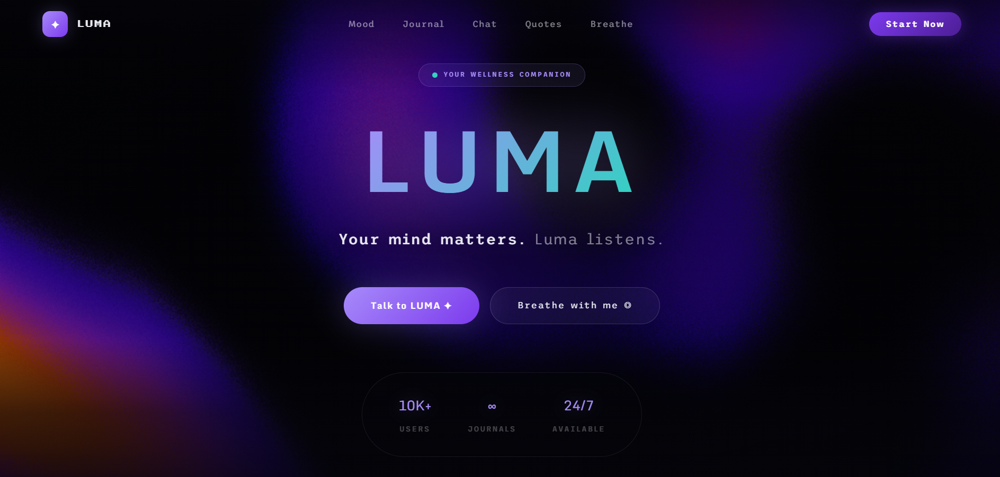
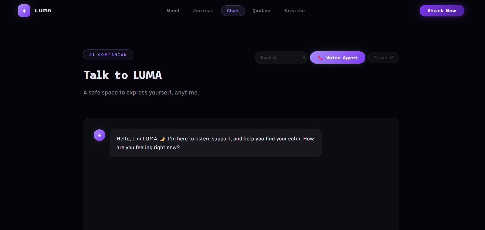
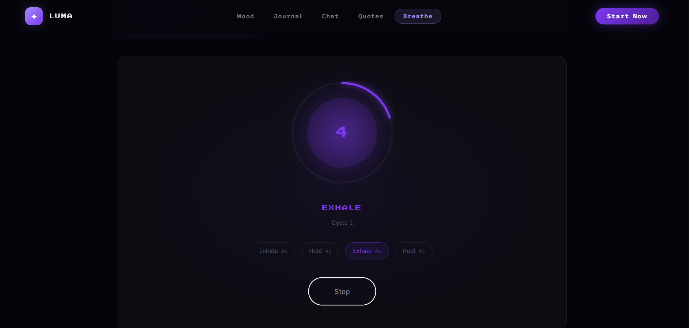
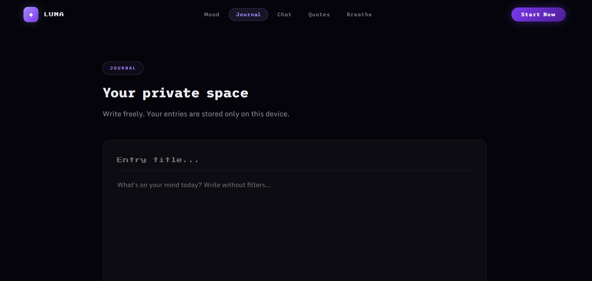
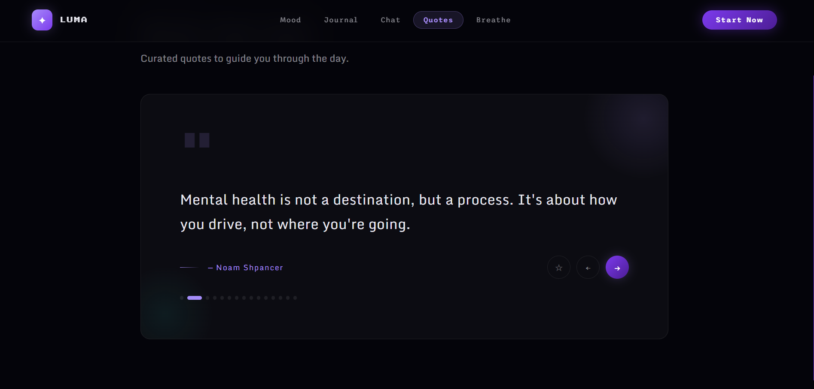

# 🫧 LUMA – AI Mental Wellness Platform

LUMA is a modern, AI-powered mental wellness platform designed to support emotional well-being in a simple, safe, and interactive way.  
It helps users express themselves, reduce stress, and build healthy mental habits.



---

## ✨ Features

### 🤖 AI Chat Companion
Talk freely with LUMA anytime. Get supportive, calm, and helpful responses in a safe environment.



---

### 🧘 Breathing Exercise
Interactive breathing guide to help you relax, reduce anxiety, and regain focus.



---

### 📓 Private Journal
Write your thoughts freely. Your entries stay private and stored locally.



---

### 💬 Inspirational Quotes
Curated quotes to motivate and guide you throughout the day.



---

## 🎯 Purpose

LUMA is built to:
- Provide a **safe space** for expression  
- Encourage **self-reflection**  
- Help users manage **stress & anxiety**  
- Promote **mental clarity and balance**  

---

## 🛠️ Tech Stack

- ⚛️ React  
- 🎨 CSS / Tailwind  
- ⚡ Vite  
- 🤖 AI Integration  

---

## 🚀 Getting Started

```bash
git clone https://github.com/your-username/luma.git
cd luma
npm install
npm run dev
```

---

## 🌌 Vision

> *“Your mind matters. LUMA listens.”*

---

### ⚠️ Important (for images to show)

- Put these files in your repo:
  chatbot.png
  breathe.png
  homepage.png
  journal.png
  quote.png
